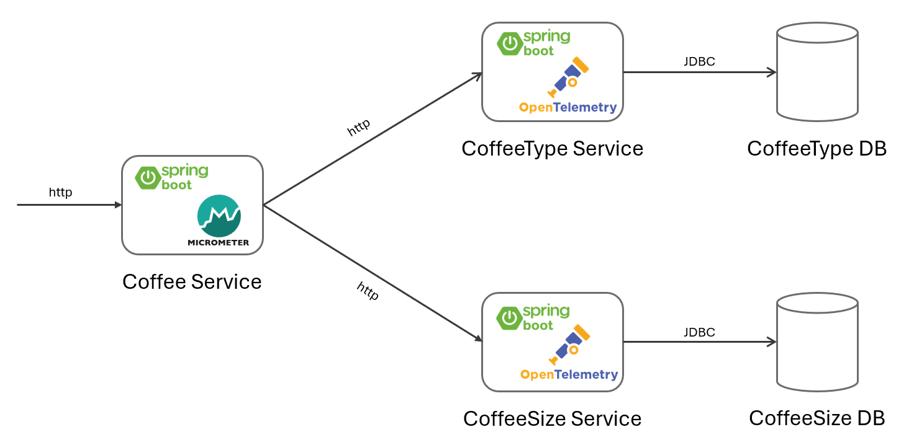
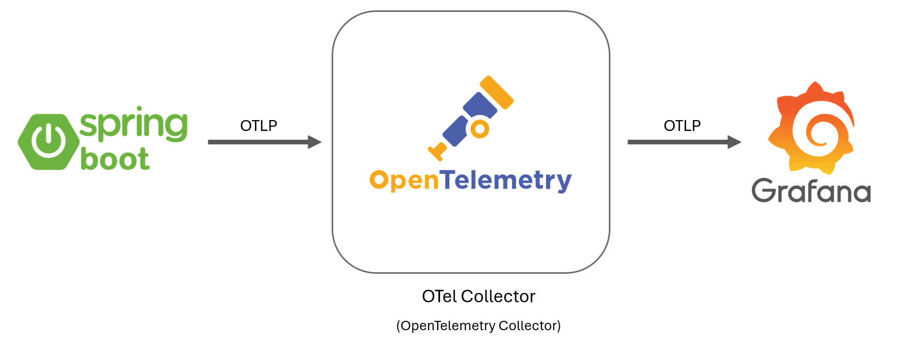

# Coffeehouse

**Coffeehouse** is a sample application that demonstrates how to integrate observability—specifically **tracing**—into a Spring Boot 3 application.

## 🚀 Getting Started

To run the Coffeehouse application locally, follow these steps:

### 1. Set Environment Variables

Before starting the services, define the required database credentials.  
Create a `.env` file in the project root with the following content:

```env
MYSQL_USER=your_mysql_user
MYSQL_PASSWORD=your_mysql_password
MYSQL_ROOT_PASSWORD=your_root_password
```

### 2. Start Infrastructure Services with Docker Compose
Once the environment variables are set, start the infrastructure services:
```env
docker compose up -d
```

### 3. Run the Spring Boot Application

### 4. View Traces in Grafana Tempo
Once the application is running and generating traces, you can visualize them in Grafana Tempo.

Open your browser and go to: http://localhost:3000

Use the Grafana interface to explore traces, view span details, and understand the flow of service calls.

---

## 🔍 What It Shows

The project illustrates two approaches to distributed tracing in Spring Boot:

- Using **Micrometer** in combination with **OpenTelemetry**
- Using the **OpenTelemetry starter dependency** on its own

The application focuses **exclusively on tracing** (not metrics or logging).

## ✅ Key Highlights

- Fully compatible with **Spring Boot 3**
- Demonstrates both **Micrometer + OpenTelemetry** and **OpenTelemetry-only** setups
- Shows how to enhance traces using the **Spring Observation API**
- Clear and modular design for easy comparison of tracing approaches

---

## 🧩 Architecture

The **Coffeehouse** application consists of three microservices:

- **Coffee Service**  
  Acts as the main entry point. It uses **Micrometer** for tracing and delegates requests to other services.

- **CoffeeType Service**  
  Handles coffee type information and stores data in **CoffeeType DB**. It uses **OpenTelemetry** directly for tracing.

- **CoffeeSize Service**  
  Handles coffee size information and persists data in **CoffeeSize DB**. Also uses **OpenTelemetry** for tracing.

All inter-service communication is done over **HTTP**, and data persistence uses **JDBC**.



## 📡 Flow of Telemetry Data

The diagram below illustrates how tracing data flows through the system:

1. Each Spring Boot service exports trace data via the **OTLP** protocol.
2. The data is sent to the **OpenTelemetry Collector**.
3. The collector then forwards the telemetry data to **Grafana** (or another backend) for visualization and analysis.

